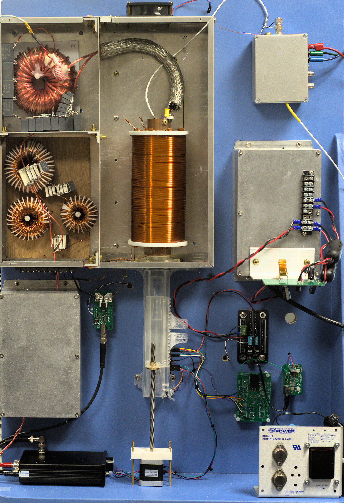
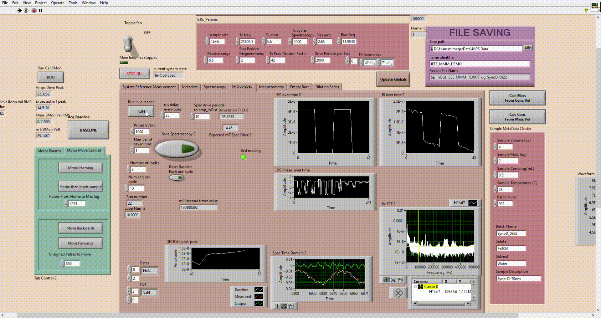
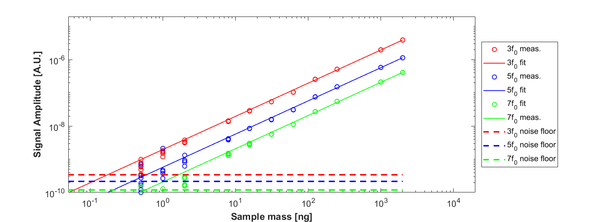
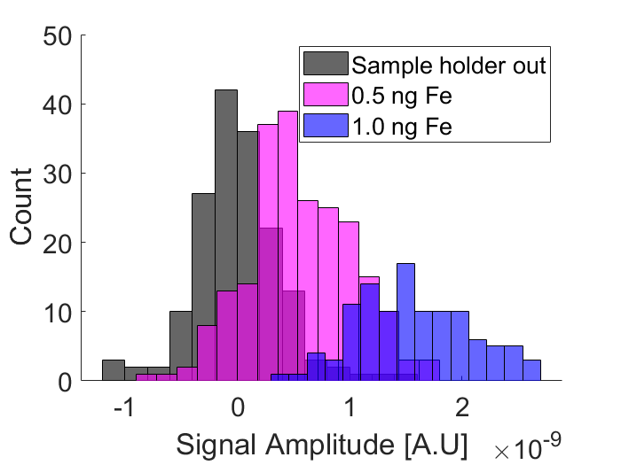

# The Magnetic Particle Spectroscopy (MPS) device
# [Link to the wiki](https://github.com/OS-MPI/MPS/wiki)
# [Link to the Main OS-MPI Page](https://os-mpi.github.io/)

Screen recording of the main user interface with a 2 microgram sample (Synomag D 70nm) being inserted and removed.

## Motivation and Introduction

The system we are calling the MPS device is a low cost, and fairly simple to manufacture project which more generally speaking is a platform designed around understanding magnetic characteristics of superparamagentic iron oxide nanoparticles (SPIONs).

## State of the project

The MPS system is still being actively developed. In the current state (of Nov, 2022) well with high sensitivity. The recent progress has been toward improving the hardware and user interface.

## Example results

The sensitivity of the system illustrated by plotting the signal amplitude from various masses of Synomag-D 70nm against the mass of each sample. The volume of each sample was 4 microliters and acquisition time was under one second for each. 

Histogram comparing 500pg and 1ng to the signal with the sample out. 

## Future work

The main goal is to upgrade the documentation. Namely, adding the full software, protocols for operation, and data format guidelines.

With any issues regarding the project or missing files/documentation, [please reach out to the authors of this project here](https://github.com/OS-MPI/MPS/wiki/Contact-Us).
