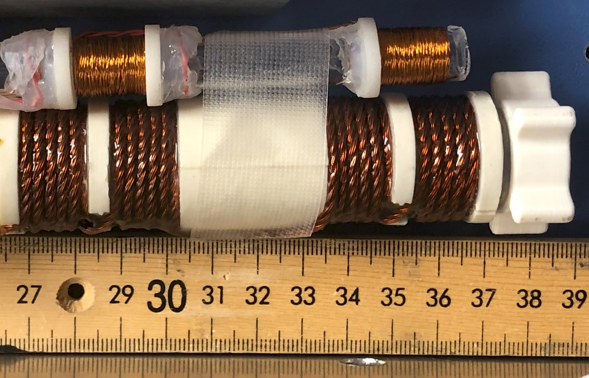
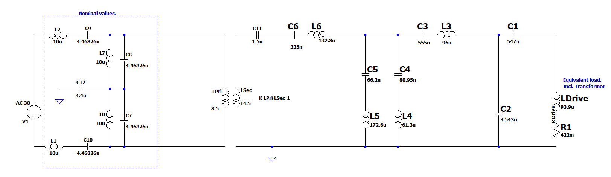
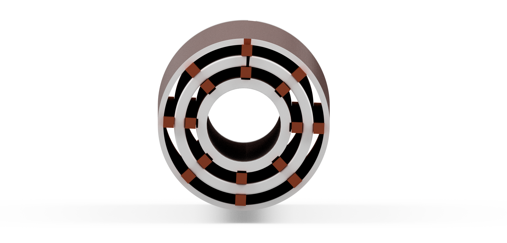

# The Magnetic Particle Spectroscopy (MPS) device
# [Link to the wiki](https://github.com/OS-MPI/MPS/wiki)
# [Link to the Main OS-MPI Page](https://os-mpi.github.io/)

## Motivation and Introduction

The system we are calling the MPS device is a low cost, and fairly simple to manufacture project which more generally speaking is a platform designed around understanding magnetic characteristics of superparamagentic iron oxide nanoparticles (SPIONs). The motivation was to condense the numerous existing systems into a singlular platform capable of providing insights into the nanoparticles irrespective of the specific goal of the lab. With that in mind, calling our platform an "MPS" system is rather imprecise; while one mode is traditional "spectroscopy" the device is designed to be flexible and able to perform relaxometry measurements as well as magnetometry, yet in order to give the project an easy-to-find, descriptive name, we settled on the "magnetic particle spectroscopy" system. 

## State of the project

In the current state (of March 2024) we have the system working in all [primary operational modes](https://github.com/OS-MPI/MPS/wiki/Modes-of-operation). It is capable of sensitively detecting SPIONs to the ng Fe level, quantifying the magnetization spectra, tracing the hysteresis loops, etc. 

The primary focus now is improving the documentation.

## System overview

Broadly speaking, there are four principle hardware components, the three coils (drive, receive, and bias) and the sample positioner. The drive coils produce magnetic fields (typ. 10 mT) which cause the SPIONs within the bore to go into and out of saturation at 23.8 kHz. This changing magnetism induces a voltage in the receive coils. The bias coils allow for the quasistatic operating point of the SPIONs to be modulated by generating low frequency (~10 Hz) fields up to about 50 mT.

### Drive/Transmit system
The drive system consists of the drive coils as well as the amplifier and filter. 

The drive coil is seen in the photograph above (the larger coil with four sub-sections). All of the four winding sections are in the same handedness. See the Wiki for further details. 

In this photograph, we utilize an in-house made Litz wire (18 strands of 28 AWG magnet wire), although other Litz wires may work similarly well. Previously a commercial Litz wire with 115 strands of 36AWG was used, but because of the plastic sleeve over the wires, they could not be easily stabilized with epoxy. 

The drive filter serves to purify and the waveform produced by the amplifier. Most amplifiers produce about 0.1% (or worse) total harmonic distortion, so without this filter those amplifier-generated distortions will dominate the noise floor. That being said, its among the most challenging components to manufacture, so its worth discussing which components are essential, and which are more or less optional. Refering to the schematic below, the two most important sections are the tuning/matching capacitors (C1 and C2), and the transformer (LPri and LSec). The tuning capacitors form a resonant circuit with Ldrive (the drive coil's equivalent load). This can be seen if you notice the loop formed by C1 C2 and LDrive is resonant. The choice of values for C1 and C2 is to make the equivalent impedance 8 ohms or so. The transformer should be a ferrite such as N87 and be designed such that the core flux is well below saturation (~20x lower, so 20ish mT). The purpose is to mitigate common-mode noise and provide isolation/break any ground loops. The other filter components can be "dropped in" later without disturbing the overall circuit. But these additional filtering components are both the most challenging to build, and less necessary. 

Many different drive amplifiers can be used. We have used both linear and switch-mode amplifiers with success. For a basic system, the AIYIMA A07 can be used, or other amplifiers based on the TPA3255 will likely be good choices. For example Nobsound G2 pro is also likely good and is pre-configured to be in PBTL mode. That IC from Texas Instruments has excellent performance given the cost and high switching frequency. The AE Techron 7224 is considerably more expensive, but produces a much higher fidelity waveform and has far more power available.

### Receive system

The receive system consists of the gradiometer receive coils, the filter, matching transformer, and preamplifier. The receive coil is a simple gradiometer to mitigate the net voltage induced from the changing magnetic drive fields (60-80 dBc attenuation of the voltage is a reasonable target). The filter reduces the amplitude of the signal at the drive frequency, but doesnt fully remove it. The matching transformer steps up the voltage produced by the receive coil (post filter) to improve the noise performance of the system. The transformer also provides isolation and common-mode supression, which help signal fidelity. The preamplifier amplifies the signal to a level more usable by the data acquisition hardware. In our case, we digitize the signals with a National Instruments NI PXIe 6363 and 6361. 

### Bias system

The bias system applies a low frequency (~10Hz), high amplitude waveform to probe the magnetization response at different quasistatic operating points. "Quasistatic" is emphasized here just because we utilize the assumption that this frequency is so low relaxation effects are negligible.

The system was initially designed to allow for even very small SPIONs (e.g. 5nm) to be probed out toward saturation, so many turns were added and cooling spaces were added to allow air to pass between the windings. With this design, passive convection is sufficient for normal operation at 50 mT peak. For up to 100 mT peak, lower duty cycles, or forced air should be used. 

This coil can be neglected if only hysteresis loop tracing or spectroscopy modes will be used. In that case, the diameter of the shielding tube should be increased to about 50-60 mm diameter. 

### Sample positioner

An automatic sample positioner is used to allow for consistent placement of the SPIONs as well as having the sample move in and out repeatedly to allow for multiple baselines to acquired. 

### Software

The software is written with LabVIEW 2021. Labview is not backwards compatible, so it must be operated with version 2021 or newer. 

With any issues regarding the project or missing files/documentation, [please reach out to the authors of this project here](https://github.com/OS-MPI/MPS/wiki/Contact-Us). 

