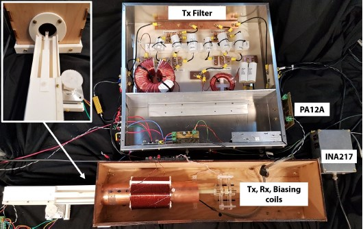

# The Magnetic Particle Spectroscopy (MPS) device
# [Link to the wiki](https://github.com/OS-MPI/MPS/wiki)

## Motivation and Introduction

The system we are calling the MPS device is a low cost, simple to manufacture project which more generally speaking is a platform designed around elucidating particle characteristics for superparamagentic iron oxide nanoparticles (SPIONs). The motivation was to condense the numerous existing systems into a singlular platform capable of providing insights into the nanoparticles irrespective of the specific goal of the lab. With that in mind, calling our platform an "MPS" system is rather imprecise; while one mode is traditional "spectroscopy" the device is designed to be flexible and able to perform relaxometry measurements as well as magnetometry, yet in order to give the project an easy-to-find, descriptive name, we settled on the "magnetic particle spectroscopy" system. 

## State of the project

As with all other systems hosted on this GitHub page, the MPS system is still being actively developed. In the current state (of Feb. 17, 2020) we have the system working in "magnetometry mode" and "spectroscopy mode" well using the Apex PA12A and INA217 for drive and preamplifiers respectivly. Though we are currently using larger commercial bias amplifier primarily for development purposes (they are higher power and lower noise) though the TDA7391 and TDA7294V both are working. The main upcoming goals will be to refine the software. Namely the relaxometry analysis needs further work, and cleaning/commenting code is in progress. We are also working on the next preamplifer circuit, but the existing one's PCB files (plus the other amplifier's circuitboards) will be uploaded.

