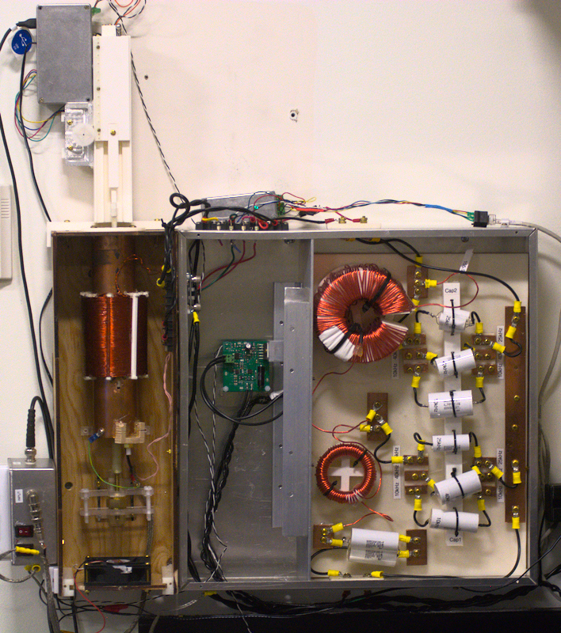

# The Magnetic Particle Spectroscopy (MPS) device
# [Link to the wiki](https://github.com/OS-MPI/MPS/wiki)
# [Link to the Main OS-MPI Page](https://os-mpi.github.io/)

## Motivation and Introduction

The system we are calling the MPS device is a low cost, and fairly simple to manufacture project which more generally speaking is a platform designed around understanding magnetic characteristics of superparamagentic iron oxide nanoparticles (SPIONs). The motivation was to condense the numerous existing systems into a singlular platform capable of providing insights into the nanoparticles irrespective of the specific goal of the lab. With that in mind, calling our platform an "MPS" system is rather imprecise; while one mode is traditional "spectroscopy" the device is designed to be flexible and able to perform relaxometry measurements as well as magnetometry, yet in order to give the project an easy-to-find, descriptive name, we settled on the "magnetic particle spectroscopy" system. 

## State of the project

There may be a few out of date components in the Inventor files by accident. Nothing major, but the ones uploaded prior to Sept. 9, may not be the optimal part. If you are planning on building a system and downloaded the parts with these ones it may be worth checking back for updates. They will be within the week (by Sept 16 or so).

As with all other systems hosted on this GitHub page, the MPS system is still being actively developed. In the current state (of Sept, 2020) we have the system working in all [three primary operational modes](https://github.com/OS-MPI/MPS/wiki/Modes-of-operation). The hardware is being continually improved, recently focusing on the system amplifiers and the power supplies. The drive amplifier is now based around the OPA549, which has proved more robust than the previous designs, and should be able to be parallelized for increased power. We would like to test out paralellizing the drive amplifiers and documenting this addition. For the power electronics, we are making it compatible with switching power supplies, which means adding substantial filtering and regulation (to power motors/fans, which use +12V as opposed to the +24V for the drive amp).

The other main goal is to upgrade the documentation. Namely, add protocols for operation, and data format guidelines. 

With any issues regarding the project or missing files/documentation, [please reach out to the authors of this project here](https://github.com/OS-MPI/MPS/wiki/Contact-Us). 

